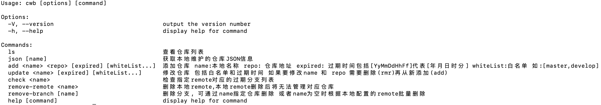

## 删除远程分支 可以通过 配置过期时间 批量删除远程分支 同时支持配置白名单

## 使用说明

### 全局安装 或在指定目录内局部安装 
```
npm install @js-spider/branch-manage -g
```

### 局部安装

```
npm install @js-spider/branch-manage --save-dev
```

### 安装完成后 通过执行 `cwb` 查看命令

